# ICE❤️
```
            mmmmmm      mmmm   mmmmmmmm           
            ""##""    ##""""#  ##""""""           
              ##     ##"       ##                 
              ##     ##        #######            
              ##     ##m       ##                 
            mm##mm    ##mmmm#  ##mmmmmm           
            """"""      """"   """"""""           
                                                  
""""""""""                              """"""""""
```
E-Mail: mikotochan@waifu.club
## Environment💻  


## Skills✨


## Stats🗒️
  

## My Waifus❤️

## Contribute Calendar📆

<!--
**stk2598/stk2598** is a ✨ _special_ ✨ repository because its `README.md` (this file) appears on your GitHub profile.

Here are some ideas to get you started:

- 🔭 I’m currently working on ...
- 🌱 I’m currently learning ...
- 👯 I’m looking to collaborate on ...
- 🤔 I’m looking for help with ...
- 💬 Ask me about ...
- 📫 How to reach me: ...
- 😄 Pronouns: ...
- ⚡ Fun fact: ...
-->
